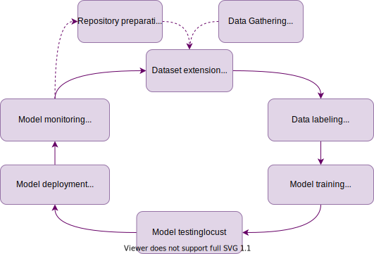

# Pediatric Bone Age Assessment

In this project, we introduce the problem of pediatric bone age assessment. During an organism’s development, the bones of the skeleton change in size and shape. Difference between a child’s assigned bone age and chronological age might indicate a growth problem. Clinicians use bone age assessment in order to estimate the maturity of a child’s skeletal system. 

Bone age assessment usually starts with taking a single X-ray image of the left hand from wrist to fingertips. Traditionally, bones in the radiograph are compared with images in a standardized atlas of bone development. This recipe represents a core approach described in _"Paediatric Bone Age Assessment Using Deep Convolutional Neural Networks" by V. Iglovikov, A. Rakhlin, A. Kalinin and A. Shvets_, [link 1](https://link.springer.com/chapter/10.1007%2F978-3-030-00889-5_34), [2](https://www.biorxiv.org/content/biorxiv/early/2018/06/20/234120.full.pdf). 

We validate the performance of the method by using data from the 2017 Pediatric Bone Age Challenge organized by the Radiological Society of North America (RSNA). The data set has been contributed by 3 medical centers at Stanford University, the University of Colorado and the University of California - Los Angeles. Originally, the dataset was shared by the AIMI Center of Stanford University and now can be freely accessed at [Kaggle platform](https://kaggle.com/kmader/rsna-bone-age). For the sake of simplicity, we skip intense preprocessing steps as described in the original work and provide radiographs with already removed background and uniformly registered hand imagess.    

 
  
*Original and preprocessed radiographs of a hand of 82 month old (approx. 7 y.o.) girl*

# Quick Start

_Note: This approach is suitable for those, who want to quickly grasp the ML insights applied in this project._

### Setup the environment
1. Sign up at [neu.ro](https://app.neu.ro) platform

2. Install the platform CLI and pipeline engine [Neuro-flow](https://github.com/neuro-inc/neuro-flow) following [this](https://docs.neu.ro/getting-started#installing-cli) guide.

3. Activate the storage
    ```shell
    neuro mkdir storage:
    ```
4. Provide an access to GitHub from within the job: geneate [GitHub SSH key](https://docs.github.com/en/github/authenticating-to-github/generating-a-new-ssh-key-and-adding-it-to-the-ssh-agent) and [upload](https://docs.neu.ro/core/secrets) its private key part to the platform as a secret with "gh-rsa" name

5. Clone this project repository and prepare storage to run it
    ```shell
    git clone git@github.com:neuromation/ml-recipe-bone-age.git
    cd ml-recipe-bone-age
    neuro-flow mkvolumes
    ```

### Build train image, which is used to run Jupyter notebook
```shell
neuro-flow build train
```

### Run demo recipe as the Jupyter job
```shell
neuro-flow run jupyter --param git_branch master
```

# Full cicle project development
_Note: This approach is suitable for those, who want to follow full cicle of ML project development:_

  
_Tasks to be performed within full cicle of development_

## Brief description
Each real-world ML-based project contains several repeatable, yet case-specific steps, which are performed consequently and iteratively, while reaching a general goal.

Namely, the **data gathering** and **dataset creation or expansion** are distinguished with (1) reproducibility and (2) trackability reasons.
In this particular case, we use [DVC](https://dvc.org/) to track our image files. While binaries are tracked by DVC and stored on the platform [storage](https://docs.neu.ro/core/storage), we use [GIT](https://git-scm.com/) to track changes in code and in the dataset (DVC files).

To **annotate** previously unseen images, one might integrate various tools, depending on specific needs and provided functionality.
Here we integrated [Label studio](https://labelstud.io/), which enables us to involve domain experts for participation.
They are able to enhance the dataset via a single link where a fancy web UI is hosted and deduce, what is the pediatric age and gender of a human being displayed on each particular picture.

When the data is ready, we might start **training the model**, experiment with its architecture and hyperparameters.
Yet, at this point, we should keep track of all our experiments and their meta-information, namely, which model architecture, dataset, hyperparameters, code version, etc. was used.
To accomplish this task we integrate [MLFlow](https://www.mlflow.org/).
The model itself is created using [TensorFlow](https://www.tensorflow.org/) and the training is controlled using the [Catalyst library](https://github.com/catalyst-team/catalyst).
This new and rapidly developing [library] can significantly reduce the amount of boilerplate code.
If you are familiar with the TensorFlow ecosystem, you can think of Catalyst as Keras for PyTorch.

When the potential model candidate is ready to be deployed, one would need to **test it** in a **canary deployment**. For this reason, we use wrap trained model into docker image using [S2I](https://github.com/openshift/source-to-image) tool, deploy this docker image directly into the platform and verify how well it works via [Locust](https://github.com/locustio/locust) from the accuracy, RPS and inference time perspectives.

If the model is good enough, we might proceed with the **deployment** into [Seldon](https://www.seldon.io/), which also has **monitoring** facilities.

At this point, the cycle is closed and we could quickly reiterate as new ideas arise.

---
## Step-by-step run

**Note:** before diving into this part, make sure you have successfully [set the environment up](#setup-the-environment) following the steps described above.

### Step 1: Gather the data
This step should be performed once at the beginning, there is no need to run it on subsequent iterations again.
It is dedicated to download the *full dataset* from BLOB storage to platform storage for future use.
Late we will cut out part of it to expand our working dataset.

To acomplish this step, execute `prepare_remote_dataset` job.
```shell
neuro-flow run prepare_remote_dataset
```

Later you could re-download the dataset (if needed) by passing one of defiled within a job description parameters, namely, *force*:
```shell
neuro-flow run prepare_remote_dataset --param force True
```

---
### Step 2: Prepare Git repository
Since you're going to commit changes in the dataset and potentially in code, it is rather a good idea to checkout a separate branch in your repository and later review all changes that were made.

Run this job to setup a new branch in you git repo, which you will later use in this iteration.
This is more for convenience, but you could naturally perform locally.
Fisrt - select a base branch, which will be the base for your iteation.
Second - pick a name for your experiment branch.
Finally - run the job with those two parameters specified.
In this example we will simply use our current (master) branch as a base and create a new branch with *-experiment* suffix in its name.

You also should build a *cpu_worker* docker image, which will be used to run this job.

```shell
BRANCH=$(git branch --show-current)
EXPERIMENT_BRANCH=${BRANCH}-experiment

neuro-flow build cpu_worker
neuro-flow run prepare_git --param git_branch ${BRANCH} --param create_git_branch ${EXPERIMENT_BRANCH}
```

---
### Step 3: Dataset expansion
The next step is the extension (or creation at first time) our *working dataset* - the dataset, which will be used to train the models.
In this step we implement one of dosens possible ways of dataset expansion - simply cut out part of *full dataset*.

This job has two parameters, namely, *extend_dataset_by* - number of images to add (50 by default) and *git_branch* - branch name which will be used as a base.

The results will be commited into the DVC and tracked by GIT as a separate commit in the specified branch of your repository.

```shell
neuro-flow run extend_data --param git_branch ${EXPERIMENT_BRANCH}
```

After running this job, verify that new commit is added in the dedicated branch and the DVC files are changed in this commit.

---
### Step 4: Data labeling
To annotate such specific dataset it is often required to involve doman speciallists.
And often those folks are not really into the ML or programming.
Moreover, managing such tasks in manual fashion even for developers is an error-prone approch.

Therefore, we integrate an open-souce dataset annotation tool Label studio.
In this job we take several images from the *full dataset* without their annotations and launches preconfigured Label studio to work on them.
When all images are labeled, the Label studio is shut down, we merge new images into our dataset and commit changes into DVC and GIT.

There is also a custom docker image created for running Label studio, which you should build before running the job.
As with other images in this project, you need to do it only once.

Afterward, run the *label_studio* job specifying which git branch to use (*git_branch* parameter) and optionally specifying, how many images to annotate (*extend_dataset_by* parameter).

```shell
neuro-flow build label_studio

neuro-flow run label_studio --param git_branch ${EXPERIMENT_BRANCH}
```

---
### Step 5: Model training
When the time comes to model training we should be sure that no single piece of information is lost and therefore, we bind our trainig script with MLFlow server, running in a separate job.

1. __MLflow server__

    The MLFlow server, in turn, requires an access to the database, where metrics of all executed experiments are be persisted.

    Therefore, we first create a neu.ro disk for storing the backend database (PostgresDB) data persistantly and start the database itself.

    ```shell
        neuro disk create --timeout-unused 60d 5Gb --name ml-recipe-bone-age-postgres
        neuro-flow run mlflow_postgres
    ```

    Afterwards, we start MLFlow server itself.
    ```shell
        neuro-flow run mlflow_server
    ```
    Those jobs could be left in the background for consequent runs and there is no need to re-run them on each iteration.
    As a backend for artifact store in MLFlow we use platform storage, whose volumes will be mounted into the MLFlow job itself and into the training job.

    In case if one wants to execute training locally, we also created *webdav_mlflow* job.
    It could be used to launch a WebDAV server with MLFlow artifacts, which later could be mounted into the file system on local machine.

2. __Trainig job__

    When the tracking server is ready, we might proceed with the model training.
    To do so, we created a *train* job, which assumes that you already have an MLFlow job running.
    Under the hood, it performs several steps: checks out target *git_branch* in the repository, checks out dataset version via DVC, launches training script, which automatically logs all metrics, parameters and artifacts.

    Before launching trainig, make sure *train* image does exist.

    ```shell
    neuro-flow build train
    neuro-flow run train --param git_branch ${EXPERIMENT_BRANCH}
    ```

    When the training is started, a new experiment record appears in web UI of MLFlow, where all parameters are stored and progress metrics are dumped.
    After the finish, all train artifacts are safely stored on the platform storage including model binary file.

---
### Step 6: Model testing
1. __Test model deployment__

    Assume you are sattisfied with the training metrics, now the time comes to wrap the model binary into RESTfull API and test it.
    We wrap model usin the S2I library, and for tests we integrate Locust tool.

    There is another reason to use S2I library - later we use this [wrapper](https://docs.seldon.io/projects/seldon-core/en/v1.6.0/python/index.html) for model deploymen into Seldon.

    As for the Locust - it is a free load generator, which has great analytics and visualisation capabilities and able to validate the responces of RESTfull API.
    We test the prediction accuraccy by allowing for model to make a mistake not more than for X month in age estimation. 
    If the error violates the threshold - we count it as a failure.

    To build the model wrapper call:
    ```shell
    neuro-flow build inference
    ```
    *Caution: build of inference wrapper might take a while. You need to execute it only once*

    When the model wrapper is ready, it is about time to deploy a concrete model binary.

    First, find the run ID of in the MLFlow web UI - open needed experiment by clicking on it and on the top of the screen you will see the line "Run <32 hex chars>.
    This is what you need.

    Next, run the inference job:
    ```shell
    neuro-flow run deploy_inference_platform --param run_id <id>
    ```

    You will also need the inference endpoint HTTP URL, which could be found by adding the "/predict" preffix to the job HTTP URL.
    The later is derived by:
    ```shell
    neuro-flow status deploy_inference_platform
    ```

    Output example:
    ```shell
    > ...
    > Http URL  https://ml-recipe-bone-age-test-inference--yevheniisemendiak.jobs.neuro-compute.org.neu.ro
    > ...
    ```

2. __Generating the load__

    Launch the Locust load generator by executing:
    ```shell
    neuro-flow run locust
    ```

    When the job starts, a web UI of it will be automatically oppened in your default browser.
    Paste the link to your endpoint (something like "https://ml-recipe-bone-age-test-inference--yevheniisemendiak.jobs.neuro-compute.org.neu.ro/predict" ) into the "Host" field of Locust.
    Set also number of users and their spawn rate (users/second) and press "Start swarming" to launch load generator.

    RPS, responce time and failure counts could be found at various tabs, while job resource consumption could be reached via the [information](https://app.neu.ro/information) tab -> "Cluster jobs monitor" button -> your specific inference job.

---
### Step 7. Model deployment and monitoring using Seldon
The integration of MLFlow and its artifact store is done via our dedicated service running next to [Seldon Core](https://docs.seldon.io/projects/seldon-core/en/latest/index.html) in the Kubernetes cluster.

To get the insights of how to deploy the integration service and use it for building your MLFlow server and Seldon, please refer the guidelines in a dedicated repository [github.com/neuro-inc/mlops-k8s-mlflow2seldon](https://github.com/neuro-inc/mlops-k8s-mlflow2seldon)


# Feedback
:mailbox:

Contuct us with any question you have via our website [neu.ro](https://neu.ro), or [e-mail](mailto:team@neu.ro).

Good luck!

:rocket:
