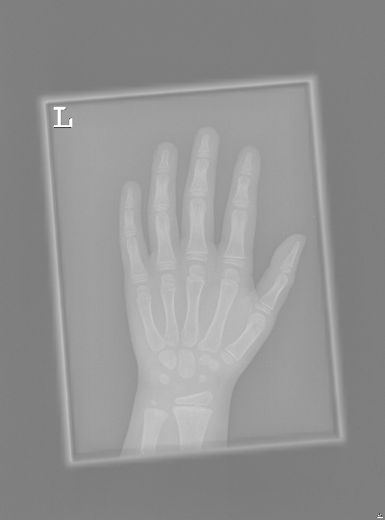
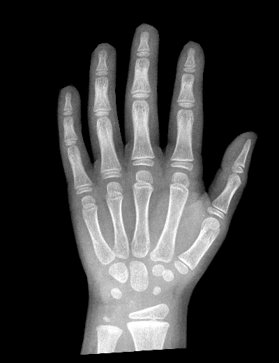

# Bone Age Assessment

# Description

In this project, we introduce the problem of pediatric bone age assessment. During organism development, the bones of the skeleton change in size and shape, and thus a difference between a child's assigned bone and chronological ages might indicate a growth problem. Clinicians use bone age assessment to estimate the maturity of a child's skeletal system. Bone age assessment usually starts with taking a single X-ray image of the left hand from the wrist to the fingertips. Traditionally, bones in the radiograph are compared with images in a standardized atlas of bone development. 

This recipe represents a core approach described in _"Paediatric Bone Age Assessment Using Deep Convolutional Neural Networks" by V. Iglovikov, A. Rakhlin, A. Kalinin and A. Shvets_, [link 1](https://link.springer.com/chapter/10.1007%2F978-3-030-00889-5_34), [2](https://www.biorxiv.org/content/biorxiv/early/2018/06/20/234120.full.pdf). 

We validate the performance of the method using the data from the 2017 Pediatric Bone Age Challenge organized by the Radiological Society of North America (RSNA). The data set has been contributed by 3 medical centers at Stanford University,  the University of Colorado and the University of California - Los Angeles. Initially, the dataset was shared by the AIMI Center of Stanford University and now can be freely accessed at [Kaggle platform](https://kaggle.com/kmader/rsna-bone-age). For the sake of simplicity, we skip intense preprocessing steps as described in the original work and provide radiographs with already removed background and uniformly registered hands.    

 
  
*Original and preprocessed radiographs of a hand of 82 month old (approx. 7 y.o.) girl*

# Quick Start

##### 0. Sign up at [neu.ro](https://neu.ro)
##### 1. Install CLI and log in
```shell
pip install -U neuromation
neuro login
```
##### 2. Run the recipe
```shell
git clone git@github.com:neuromation/ml-recipe-bone-age.git
cd ml-recipe-bone-age
make setup
make jupyter
```
##### 3. Train the model
Download the dataset from within the demo notebook, then run:
```shell
make training
```

# Development Environment

This project is designed to run on [Neuro Platform](https://neu.ro), so you can jump into problem-solving right away.

## Directory structure

| Local directory                      | Description       | Storage URI                                                                  | Environment mounting point |
|:------------------------------------ |:----------------- |:---------------------------------------------------------------------------- |:-------------------------- | 
| `data/`                              | Data              | `storage:ml-recipe-bone-age/data/`                              | `/ml-recipe-bone-age/data/` | 
| `src/` | Python modules    | `storage:ml-recipe-bone-age/src/` | `/ml-recipe-bone-age/src/` |
| `notebooks/`                         | Jupyter notebooks | `storage:ml-recipe-bone-age/notebooks/`                         | `/ml-recipe-bone-age/notebooks/` |
| No directory                         | Logs and results  | `storage:ml-recipe-bone-age/results/`                           | `/ml-recipe-bone-age/results/` |

## Development

Follow the instructions below to set up the environment and start Jupyter development session.

### Setup development environment 

`make setup`

* Several files from the local project are uploaded to the platform storage (namely, `requirements.txt`, 
  `apt.txt`, `setup.cfg`).
* A new job is started in our [base environment](https://hub.docker.com/r/neuromation/base). 
* Pip requirements from `requirements.txt` and apt applications from `apt.txt` are installed in this environment.
* The updated environment is saved under a new project-dependent name and is used further on.

### Run Jupyter with GPU 

`make jupyter`

* The content of `code` and `notebooks` directories is uploaded to the platform storage.
* A job with Jupyter is started, and its web interface is opened in the local web browser window.

### Kill Jupyter

`make kill-jupyter`

* The job with Jupyter Notebooks is terminated. The notebooks are saved on the platform storage. You may run 
  `make download-notebooks` to download them to the local `notebooks/` directory.

### Help

`make help`

## Data

### Uploading via Web UI

On local machine run `make filebrowser` and open job's URL on your mobile device or desktop.
Through a simple file explorer interface, you can upload test images and perform file operations.

### Uploading via CLI

On local machine run `make upload-data`. This command pushes local files stored in `./data`
into `storage:bone-age-assessment/data` mounted to your development environment's `/project/data`.

## Customization

Several variables in `Makefile` are intended to be modified according to the project specifics. 
To change them, find the corresponding line in `Makefile` and update.

### Data location

`DATA_DIR_STORAGE?=$(PROJECT_PATH_STORAGE)/$(DATA_DIR)`

This project template implies that your data is stored alongside the project. If this is the case, you don't 
have to change this variable. However, if your data is shared between several projects on the platform, 
you need to change the following line to point to its location. For example:

`DATA_DIR_STORAGE?=storage:datasets/cifar10`

### Training machine type

`TRAINING_MACHINE_TYPE?=gpu-small`

There are several machine types supported on the platform. Run `neuro config show` to see the list.

### HTTP authentication

`HTTP_AUTH?=--http-auth`

When jobs with HTTP interface are executed (for example, with Jupyter Notebooks or TensorBoard), this interface requires
a user to be authenticated on the platform. However, if you want to share the link with someone who is not registered on
the platform, you may disable the authentication updating this line to `HTTP_AUTH?=--no-http-auth`.

### Training command

`TRAINING_COMMAND?='echo "Replace this placeholder with a training script execution"'`

If you want to train some models from code instead of Jupyter Notebooks, you need to update this line. For example:

`TRAINING_COMMAND="bash -c 'cd $(PROJECT_PATH_ENV) && python -u $(CODE_DIR)/train.py --data $(DATA_DIR)'"`

